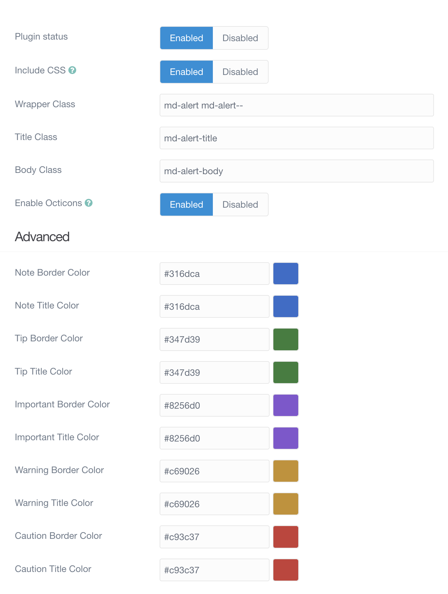
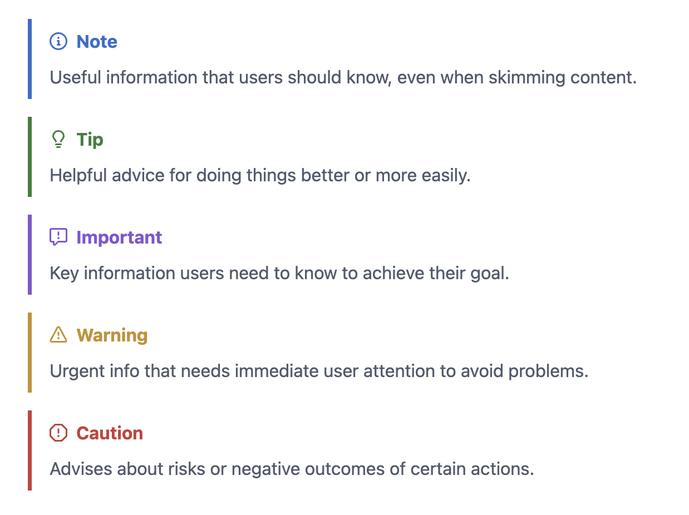
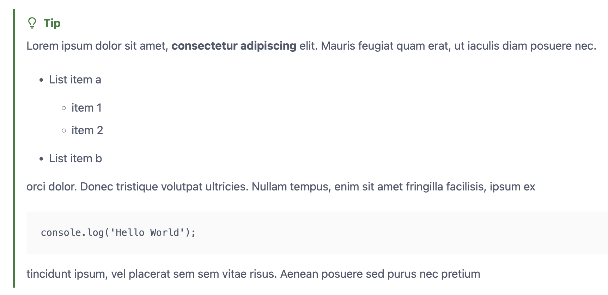

# Github Markdown Alerts Plugin

The **Github Markdown Alerts** Plugin is an extension for [Grav CMS](https://github.com/getgrav/grav). It adds support for Github Flavored Markdown Alerts to your Grav site. The documentation and syntax can be found in the [GitHub Docs](https://docs.github.com/en/github/writing-on-github/working-with-github-flavored-markdown/creating-admonitions-in-github-flavored-markdown).

## Installation

Installing the Github Markdown Alerts plugin can be done in one of three ways: The GPM (Grav Package Manager) installation method lets you quickly install the plugin with a simple terminal command, the manual method lets you do so via a zip file, and the admin method lets you do so via the Admin Plugin.

### GPM Installation (Preferred)

To install the plugin via the [GPM](https://learn.getgrav.org/cli-console/grav-cli-gpm), through your system's terminal (also called the command line), navigate to the root of your Grav-installation, and enter:

    bin/gpm install github-markdown-alerts

This will install the Github Markdown Alerts plugin into your `/user/plugins`-directory within Grav. Its files can be found under `/your/site/grav/user/plugins/github-markdown-alerts`.

### Manual Installation

To install the plugin manually, download the zip-version of this repository and unzip it under `/your/site/grav/user/plugins`. Then rename the folder to `github-markdown-alerts`. You can find these files on [GitHub](https://github.com/trilbymedia/grav-plugin-github-markdown-alerts) or via [GetGrav.org](https://getgrav.org/downloads/plugins).

You should now have all the plugin files under

    /your/site/grav/user/plugins/github-markdown-alerts
	
> NOTE: This plugin is a modular component for Grav which may require other plugins to operate, please see its [blueprints.yaml-file on GitHub](https://github.com/trilbymedia/grav-plugin-github-markdown-alerts/blob/main/blueprints.yaml).

### Admin Plugin

If you use the Admin Plugin, you can install the plugin directly by browsing the `Plugins`-menu and clicking on the `Add` button.

## Configuration

Before configuring this plugin, you should copy the `user/plugins/github-markdown-alerts/github-markdown-alerts.yaml` to `user/config/plugins/github-markdown-alerts.yaml` and only edit that copy.

Here is the default configuration and an explanation of available options:

```yaml
enabled: true
include_css: true
enable_octicons: true
wrapper_class: md-alert md-alert--
title_class: md-alert-title
body_class: md-alert-body
colors:
  note-border: '#316dca'
  note-title: '#316dca'
  tip-border: '#347d39'
  tip-title: '#347d39'
  important-border: '#8256d0'
  important-title: '#8256d0'
  warning-border: '#c69026'
  warning-title: '#c69026'
  caution-border: '#c93c37'
  caution-title: '#c93c37'
```

Note that if you use the Admin Plugin, a file with your configuration named github-markdown-alerts.yaml will be saved in the `user/config/plugins/`-folder once the configuration is saved in the Admin.



## Usage

Alerts are a Markdown extension based on the blockquote syntax that you can use to emphasize critical information. On GitHub, they are displayed with distinctive colors and icons to indicate the significance of the content.

Use alerts only when they are crucial for user success and limit them to one or two per article to prevent overloading the reader. Additionally, you should avoid placing alerts consecutively. Alerts cannot be nested within other elements.

To add an alert, use a special blockquote line specifying the alert type, followed by the alert information in a standard blockquote. Five types of alerts are available:

```markdown
> [!NOTE]
> Useful information that users should know, even when skimming content.

> [!TIP]
> Helpful advice for doing things better or more easily.

> [!IMPORTANT]
> Key information users need to know to achieve their goal.

> [!WARNING]
> Urgent info that needs immediate user attention to avoid problems.

> [!CAUTION]
> Advises about risks or negative outcomes of certain actions.
```

And here are the rendered alerts:



These alerts also support full markdown syntax inside them for example:

```markdown
> [!TIP]
> Lorem ipsum dolor sit amet, **consectetur adipiscing** elit. Mauris feugiat quam erat, ut iaculis diam posuere nec.
>
> * List item a
>   - item 1
>   - item 2
> * List item b
>
> orci dolor. Donec tristique volutpat ultricies. Nullam tempus, enim sit amet fringilla facilisis, ipsum ex
>
> ```js
>   console.log('Hello World');
> ```
>
> tincidunt ipsum, vel placerat sem sem vitae risus. Aenean posuere sed purus nec pretium
```

renders like this:



